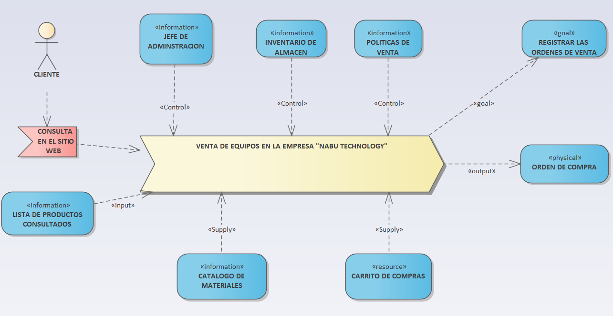
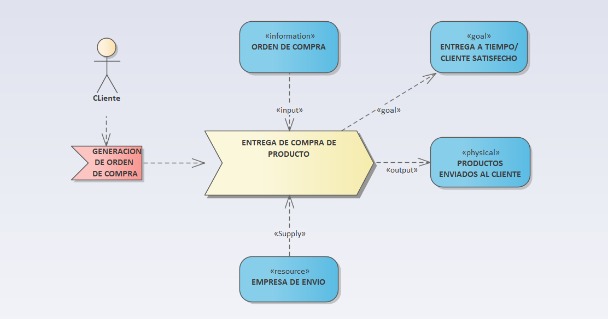
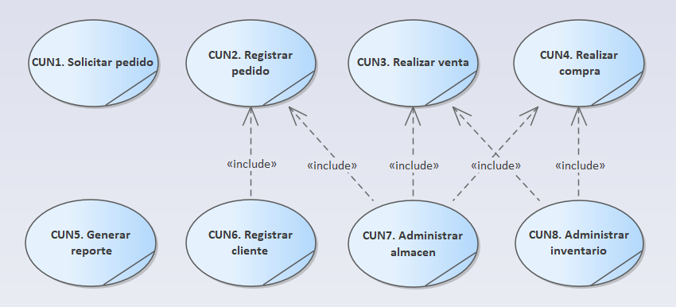
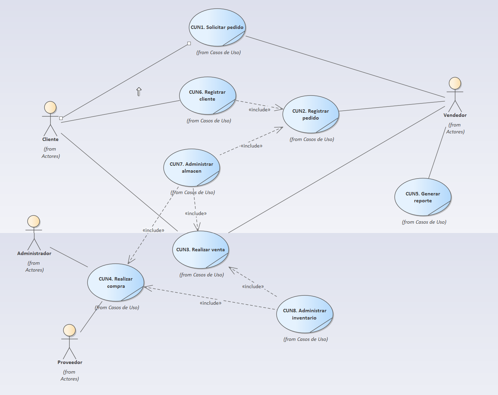
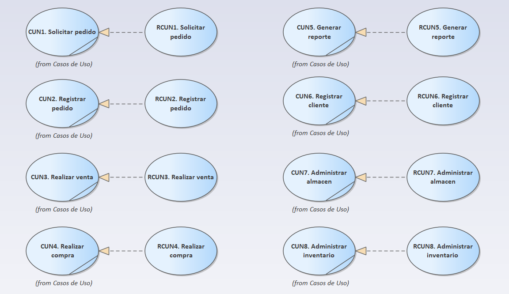
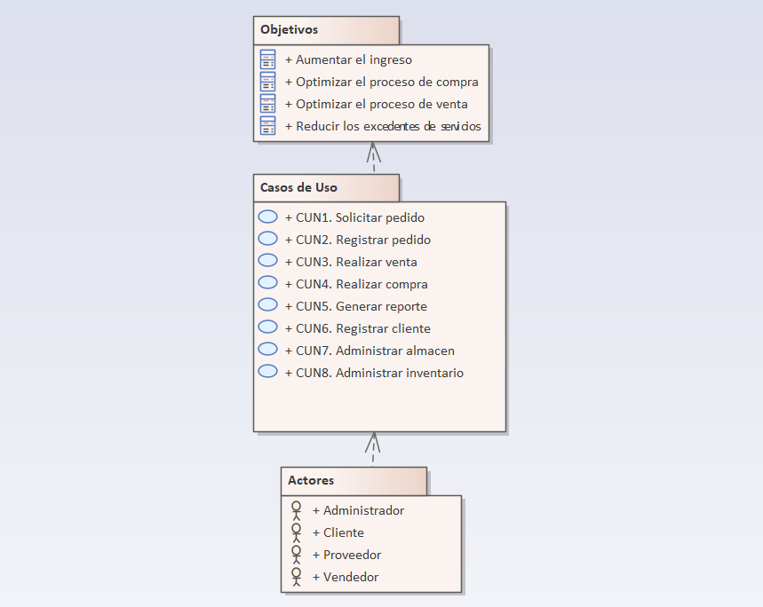
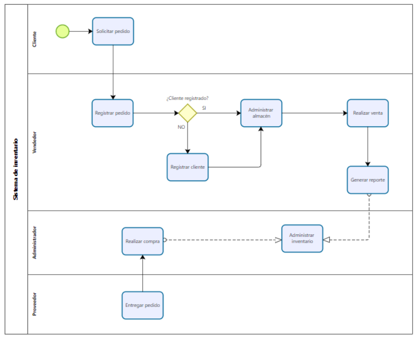
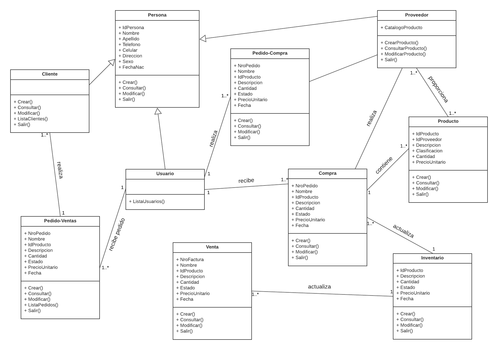
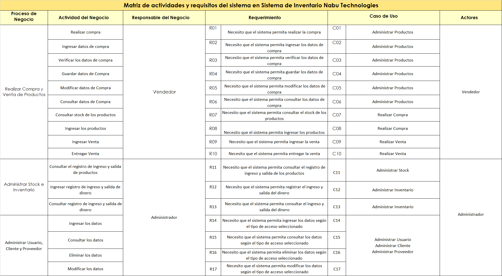

## “PROYECTO DE ANÁLISIS Y DISEÑO DE SISTEMAS”
# **SISTEMA DE INVENTARIO PARA LA EMPRESA NABU TECHNOLOGIES**

## ASESOR: RICHARD LEONARDO BERROCAL NAVARRO 
### ORCID: 0000-0001-8718-3150

INTEGRANTES:| ORCID| PORCENTAJE DE TRABAJO
---|---|---
Damazo Valdeos, David Jared| 0000-0002-4823-7379| 100%
Esteban Lastaunado, Dibail Sidane| 0000-0002-3473-338X| 100%
Lopez Roman, Segundo Artemio| 0000-0001-9993-6797| 100%
Obregon Moran, Max Smith| 0000-0001-9226-5388| 100%
Remigio Ramirez, George Neffer| 0000-0002-7269-5927| 100%
Rocca Puma, Maykol| 0000-0003-2979-0715| 100%
Rojas Flores, Daniela Ariana| 0000-0001-7975-4785| 100%

## RESUMEN EJECUTIVO:
Somos una microempresa que lleva 3 años en el mercado, que busca brindar servicios de venta de plásticos. Tenemos como principales actividades: fabricación de productos de bolsas de plásticos y venta al por menor productos nuevos en comercios especializados. Este trabajo está enfocado en la implementación de un sistema de inventario en la empresa "Nabu Technologies" que tiene entre sus propósitos mejorar reducir los excedentes de servicios, aumentar el ingreso en la empresa, practicar las políticas medioambientales, optimización de proceso de venta.

## INTRODUCCIÓN:

Actualmente en coyuntura por la pandemia del COVID-19 el uso de tecnologías a nivel mundial vio un auge en el uso de la información (Del Mar, 2018) , esto ha dado paso a diversos países en incrementar la enseñanza virtualizada de la programación para grandes sectores  informáticos entre ellos los lenguajes de programación se popularizaron por el incremento de puestos de trabajo como programadores ,a raíz de esto diversos países ve reflejado en la mejora de los resultados en la adaptación y al uso de las tecnologías en el manejo de Inventarios en centros comerciales (Hernández et al., 2017) .

En Latinoamérica también se ha visto esta situación, según los últimos registros nos da a conocer que muchos países como Ecuador, Brasil, Paraguay, entre otros, han incrementado el uso de la tecnología virtual y la globalización de las TIC. En Ecuador se puede evidenciar el uso del modelo administrativo mediante la dinámica de sistemas en la gestión de inventarios, siendo esta el fortalecimiento de las operaciones empresariales, es de precisar que esta tiene el estudio fundamentalmente en el visón al futuro de las estrategias administrativas. (Samaniego, 2019).

Asimismo, el Perú se viene adaptando a la implementación de las nuevas tecnologías en los diferentes ámbitos sociales y organizacionales, frente a las deficiencias en la implementación y modernización de las empresas y microempresas en el manejo de la base de datos e inventarios, cabe indicar que la aplicación de la inventarios en la actualidad es imprescindible para un mejor manejo de la productividad laboral en los diferentes sectores mediante la innovación tecnológica (Rojas, 2017).

En cuanto (Ríos, 2018), en su estudio de “Sistema Web para mejorar el control de inventarios en la empresa Comercial Lucerito, 2018”, nos muestra como objetivo proponer un sistema web para mejorar el control de inventario en la empresa Comercial Lucerito, diagnosticando el estado actual para diseñar propuestas para mejorar el control de inventario, Este estudio pretende demostrar a través de una investigación holística, teorías y conceptos validos para evaluar la problemática global de la mencionada empresa, y de esta manera propone de manera eficiente la solución al problema, con la mejora del control y centralización de la información del inventario.

Al respecto la investigación del inventario que se cuenta en la empresa “Nabu Technologies” no permite al usuario poder administrar de manera correcta sus ingresos y egresos, aun trabaja de manera anticuada registrando todo a través de boletas escritas a mano, lo cual no permite realizar una búsqueda de manera eficiente al momento de  querer visualizar registros pasados, una vez implementado el SI, se podrá visualizar de manera factible la producción exacta realizada, el material que ingresó a la empresa y distribución, todo de manera fácil e intuitiva con el usuario.

El presente informe tiene como objetivos:
 - Reducir los excedentes de servicios.
 - Aumentar el ingreso en la empresa.
 - Practicar las políticas medioambientales.
 - Optimización de proceso de venta.

### Datos de la empresa
La empresa “Nabu technologies” es una microempresa que lleva 3 años en el mercado, que busca brindar servicios de venta de plásticos. Tenemos como principales actividades: fabricación de productos de bolsas de plásticos y venta al por menor productos nuevos en comercios especializados.
Esta empresa tiene como misión querer seguir brindando nuestros servicios adecuándose a las diversas situaciones que se presenten. “Nuestra visión es lograr el crecimiento de nuestra empresa, para poder adquirir más locales y así llegar a más personas. Todo eso mediante el respaldo de nuestros clientes.”
Su organigrama está representado de la siguiente manera:

*Figura 1. Organigrama de Nabu Technologies*

## 1.	ESTUDIO DE FACTIBILIDAD
El presente proyecto tiene como objetivo medir la factibilidad que tiene la empresa Nabu Technologies, implementando un sistema de inventario que permita reducir los excedentes de servicios, aumentar el ingreso en la empresa, practicar las políticas medioambientales, tener una mejor optimización del proceso de venta.

### 1.1.	Factibilidad operativa y técnica: La visión del sistema
Nuestro sistema está programado para poder facilitar el registro y control de inventario al usuario, además de ser fácil de manejar, ayudará a evitar largas horas de sacar cuentas, siendo de costo gratuito solo se necesitará de una computadora con características básicas. 
    
#### Organización
 - Se garantiza la elaboración y utilización del software, ya que será establecida en nuestra pequeña empresa, esta se realizará y utilizará en el campo.
 - Se contará con el apoyo de nuestro grupo para el diseño, mantenimiento y realización de este software.
#### Tecnica
 - Nosotros como grupo estaremos presentes en la realización y producción del software. 
 - Será un acceso directo al programa para almacenamiento de materiales.
 - Acceso a las entradas de producción.
 - Disponibilidad de personal para el mantenimiento.
 - Disponibilidad de la tecnología para satisfacer su necesidad.

## 2.	MODELO DE NEGOCIO
En la actualidad la empresa NABU TECHNOLOGY cuenta con 3 años en el mercado, se destaca de las demás empresas en su rubro, gracias a su gran equipo de trabajo, gran producto y el trato que se le da a los clientes son todas estas características que la diferencia de la competencia.

### Diagrama de Eriksson Penker 

  
*Figura 2. Diagrama de Eriksson Penker parte 1*

  

  
*Figura 3. Diagrama de Eriksson Penker parte 2*

### 2.1. Factibilidad operativa y técnica: La visión del sistema
El Modelo de Casos de Uso del Negocio (MCUN) o vista externa incluye la lista de los actores de negocio y el diagrama de los casos de uso del negocio.

*Figura 4. Lista de Casos de Uso de Negocio*

#### 2.1.1.	Lista de Actores de Negocio
ACTOR|	Descripción
---|---
Cliente |	El cliente es quien realiza el pedido y la compra de producto.
Proveedor| El proveedor es quien proporciona los productos que son vendidos por la empresa Nabu Technologies.
Beneficiario| El beneficiario es la entidad beneficiaria a la cual se le donará una cierta cantidad de dinero por los excedentes de compra.

*Tabla No. 1. Lista de Actores del Negocio*

#### 2.1.2.	Lista de Casos de Uso del Negocio
Código |CASOS DE USO DE NEGOCIO |	Descripción
---|---|---
CUN01 |Solicitar pedido|	El cliente solicita pedido de algunos productos.
CUN02 |Registrar pedido|	El vendedor recibe el pedido pendiente del cliente.
CUN03 |Realizar venta|	El vendedor pueden ingresar y consultar las ventas.
CUN04 |Realizar compra|	El administrador y el vendedor pueden ingresar y consultar las compras.
CUN05 |Generar reporte|	El vendedor puede generar un reporte de las ventas realizadas.
CUN06 |Registrar cliente|	El vendedor pueden ingresar y consultar los clientes.
CUN07 |Administrar stock|	El administrador y el vendedor pueden consultar el registro de ingresos y salidas de producto.
CUN08 |Administrar inventario|	El administrador puede ingresar y consultar el registro de ingresos y salidas de ventas y compras.

*Tabla No. 2. Lista de Casos de Uso del Negocio*

#### 2.1.3. Diagrama de Casos de Uso de Negocio

*Figura 5. Diagrama de Casos de Uso de Negocio*

#### 2.1.4.	Especificaciones de Casos de Uso del Negocio
CUN01|	Solicitar pedido
---|---
Descripción|	Este caso de uso empieza cuando el cliente realiza el pedido de 1 o varios productos.
Actores de negocio|	Vendedor, Cliente
Entradas|	Solicitud de pedido
Entregables|	Reporte de pedido
Mejoras |	Reporte de producto más pedido.

*Tabla No. 3. CUN01 Solicitar pedido*

CUN02|Registrar pedido
---|---
Descripción|	Este caso de uso empieza cuando el vendedor recibe el pedido pendiente del cliente.
Actores de negocio|	Vendedor 
Entradas	| Solicitud de pedido, detalles del producto que quiere adquirir
Entregables	| Registrar pedido
Mejoras 	| Generar reporte de ventas de acuerdo al registro de ventas que hace el vendedor. El cliente solicitara el producto que requiere, mediante el cual el administrador podrá prever la cantidad de materia que se necesitara para la producción de lo solicitado, el mismo que en un plazo breve podrán dar respuesta a su solicitud y entrega y de esta manera poder gestionar eficientemente la producción y gastos que genera la producción.

*Tabla No. 4. CUN02 Registrar pedido*

CUN03|	Registrar venta
---|---
Descripción|	Este caso de uso empieza cuando el vendedor ingresa la venta realizada, antes verficando el stock de cada producto pedido.
Actores de negocio|	Vendedor, Cliente
Entradas	| Verificación del stock del producto pedido, detalles del producto
Entregables	|Generar reporte de ventas
Mejoras 	|Actualización de constante de los precios del producto, de acuerdo a la cotización. 

*Tabla No. 5. CUN03 Registrar venta*

CUN04|	Registrar compra
---|---
Descripción|	Este caso de uso empieza cuando el administrador ingresa el registro de productos adquiridas del proveedor.
Actores de negocio|	Administrador, Proveedor
Entradas	|Descripción de la materia prima, datos del proveedor, fecha de entrega, solicitud de cotización
Entregables	|El administrador hace una solicitud de cotización al proveedor
Mejoras 	|Actualización de constante de los precios del producto, de acuerdo a la cotización. 

*Tabla No. 6. CUN04 Registrar compra*

CUN05|	Generar reporte
---|---
Descripción|	El vendedor entrega el reporte de ventas realizadas
Actores de negocio|	Vendedor
Entradas|	Número de ventas, detalle de las ventas
Entregables|	Control de acceso e ingresos a la empresa
Mejoras |	Información ordenada de las ventas

*Tabla No. 7. CUN05 Generar reporte*

CUN06|	Registrar cliente
---|---
Descripción|	El vendedor registrará a los clientes.
Actores de negocio|	Vendedor, Clientes
Entradas|	Datos del cliente, número de compras
Entregables|	Reporte de clientes potenciales
Mejoras |	Incremento de ventas al no perder potenciales clientes

*Tabla No. 8. CUN06 Registrar cliente*

CUN07|	Administrar stock
---|---
Descripción|	El administrador desarrollará relaciones con proveedores de bienes y servicios.
Actores de negocio|	Administrador, Vendedor
Entradas|	Reporte de producto más vendido
Entregables|	Inversiones
Mejoras |	La empresa comprará el producto para generar más producción y optimizar las ventas.

*Tabla No. 9. CUN07 Administrar stock*

CUN08|	Administrar inventario
---|---
Descripción|	Inicia cuando el administrador registra la solicitud del cliente, después registra y entrega los materiales al área de producción para la fabricación del producto, asimismo inspecciona la producción, finalmente registra en el inventario y procede a la entrega al cliente.
Actores de negocio|	Administrador
Entradas|	Reporte de ventas, reporte de compras
Entregables	|El área de producción entrega al administrador lo fabricado.
Mejoras |	Mediante la implementación del sistema, el administrador podrá tener mayor control del almacén del producto, asimismo optimizará la fabricación del producto de manera eficiente, y la entrega será en el tiempo más breve para la satisfacción del cliente.

*Tabla No. 10. CUN08 Administrar inventario*

### 2.2.	Modelado de análisis de negocios
#### 2.2.1.	Lista de Trabajadores de Negocio
Nombre|	Descripción
---|---
Administrador|	El administrador tiene acceso al sistema y tiene la gestión de procesos de la empresa.
Vendedor|	El vendedor se encarga de la venta de los productos de manera eficiente y generar los reportes de ventas.

*Tabla No. 11. Lista de Trabajadores de Negocio*

#### 2.2.2.	Lista de Entidades de Negocio
A diferencia de modelo de caso de negocio en el modelo de análisis pasamos a una vista   interna   del   proceso   de “Sistema de inventario”, pudiendo analizar los trabajadores de la empresa "Nabu Technologies" y además identificaremos las entidades que se manejan en nuestro proceso.
Para la lista de las entidades de negocio (EN) utilizar el siguiente cuadro, donde:
Origen: I=Interna, generada por el propio negocio, E=Externa, generada externamente y usada por el negocio como dato o medio de comunicación; 
Tipo: P=Persistente, que almacena datos, F=Formulario o documento impreso>

Código |LISTA DE ENTIDADES DE NEGOCIO|	Descripción	|Origen|	Tipo
---|---|---|---|---
EN01 |Registro de usuario |Documento donde se encuentran los datos de los usuarios |	I	| P
EN02 |Registro de cliente	|Documento donde se encuentran los datos de los clientes|	I|	P
EN03 |Registro de proveedores	|Documento donde se encuentran los datos y características de los proveedores|	I|	P
EN04 |Registro de productos	|Documento donde se encuentran los detalles de los productos|	I|	P
EN05 |Comprobante de pago	|Documento que acreditan la realización de un pago|	E|	F
EN06 |Reporte de ventas	|Documento donde se encuentran las ventas realizadas por el negocio y sus detalles|	I|	P
EN07 |Reporte de compras	|Documento donde se encuentran las compras realizadas por el negocio y sus detalles|	I|	P

*Tabla No. 12. Lista de Entidades de Negocio*

#### 2.2.3. Realización de Casos de Uso del Negocio
Las Realizaciones de Casos de Uso del Negocio (RCUN) analizan los procesos del negocio. Los diagramas de Actividades deben reflejar los procesos de negocios ideales e incluir Swimlanes y conexiones con Objetos (Business Entities). Debe mostrarse de manera gráfica aquellas actividades que se pueden automatizar.

*Figura 6. Diagrama de Realización Casos de Uso de Negocio*

*Figura 7. Diagrama de Realización Casos de Uso de Negocio*

#### 2.2.4. Diagrama de actividades

*Figura 8. Diagrama de Actividades*

#### 2.2.5. Realización de clases de dominio

*Figura 9. Diagrama de Clases*

### 2.3. Glosario de términos
Para el glosario de términos se coloco en la siguiente tabla:

Nombre|	Descripción
---|---
ADM | Administrador
AN | Actor del negocio
BEN | Beneficiario
CLI | Cliente
CUN | Casos de uso de negocio
DA | Diagrama de actividad
DCUN | Diagramas de casos de uso del negocio
ECUN | Especificaciones de casos de uso del negocio
EN | Entidades de negocio
MCUN | Modelo de casos de uso del negocio
PRO | Proveedor
RCUN | Realización de casos de uso del negocio
RN | Regla de negocio
TN | Trabajador del negocio
VEN | Vendedor

*Tabla No. 13. Glosario de términos*

### 2.4. Reglas de negocio
Código |	Nombre | Descripción | Casos de uso afectado
---|---|---|---
RN01 | Regla 1 | El usuario solo puede tener un registro | Administrar usuario
RN02 | Regla 2 | Un producto específico solo puede tener un registro | Administrar producto
RN03 | Regla 3 | Un cliente debe tener un registro | Administrar cliente
RN04 | Regla 4 | Un proveedor debe tener un registro | Administrar proveedor
RN05 | Regla 5 | Un usuario debe tener un usuario | Administrar usuario

*Tabla No. 14. Reglas de negocio*

## 3. CAPTURAS DE REQUERIMIENTOS
Se tiene como objetivo descubrir y recoger todos y cada uno de los requisitos funcionales y no funcionales a definir de forma clara y concisa para el correcto desarrollo del sistema de inventario.

### 3.1. Fuentes de obtención de requerimientos
Para la obtención de requerimientos en la empresa Nabu Technologies, se realizo mediante entrevistas con el personal.
#### 3.1.1. Informe de entrevistas o material técnico
**Informe de Entrevistas**
Análisis de las entrevistas:
¿Cómo se sienten los trabajadores laborando en Nabu Technologies?
Más del 95% de los entrevistados respondieron satisfactoriamente mostrando tranquilidad por su puesto de trabajo. De igual forma están conforme con las horas laborales, su salario laboral y los que beneficios que reciben.
¿Cuáles son los puestos en los que trabajan?	
En la empresa existen diversos puestos el cual se dividen en dos: Administradores y Vendedores. Los primeros administran los usuarios, también a los clientes, los proveedores, los productos y el inventario. Los segundos realizan la venta de los productos y la compra de la materia prima. 
¿Cuáles son los trabajos que realizas en Nabu Technologies?
Con esta pregunta se pretende mejorar los procesos de trabajo para una mejora en la producción:
El cliente solicita un pedido al vendedor, el vendedor recibe y registra los datos del cliente, una vez ingresado los datos guarda los cambios, luego el sistema almacena en la base de datos, y el vendedor procede a realizar la venta del producto. El administrador de usuario tiene la opción de ingresar, modificar o eliminar el usuario. El administrador de proveedor puede crear, modificar y consultar. El administrador del producto puede ingresar, modificar, eliminar, consultar y el stock. El administrador de stock puede consultar el registro de ingreso y salida de los productos. El administrador de inventario puede ingresar y consultar el ingreso y salida de dinero. El vendedor atiende las compras donde ingresa y consulta los datos. El vendedor atiende las ventas las ingresa y consulta.

#### 3.1.2. Matriz de Actividades y Requerimiento
Para la matriz de actividades y requerimientos se utilizó el siguiente formato:

 
### 3.2. Modelo Casos de Uso
#### 3.2.1 Lista de Actores del Sistema
Para la lista de Actores del sistema (AS) se utilizó el siguiente cuadro:
Nombre|	Descripción
---|---
Cliente| Realiza el pedido
Proveedor| Entrega los productos pedidos por el administrador
Vendedor| Recibe el pedido pendiente, genera reporte de ventas
Administrador| Realiza la adquisisión de productos al proveedor
 
*Tabla No. 16. Lista de Actores del Sistema*

#### 3.2.2. Lista de Casos de Uso del Sistema
Para la lista de Casos de Uso del sistema (CUS) se utilizó el siguiente cuadro:
Código| Nombre|	Descripción
---|---|---
CUS01 |Solicitar pedido|	El cliente solicita pedido de algunos productos
CUS02 |Consultar pedido|	El vendedor recibe y consulta el pedido del producto
CUS03 |Registrar pedido|	El vendedor registra el pedido en el sistema
CUS04 |Reportar venta|	El vendedor reporta la venta en el sistema
CUS05 |Registrar producto|	El vendedor registra la salida del producto
CUS06 |Emitir comprobante de venta|	El vendedor emite el comprobante de venta que será entregado al cliente
CUS07 |Efectuar pago|	El cliente se asegura de efectuar el pago, antes de recibir el producto
CUS08 |Verificar stock|	El administrador y el vendedor pueden consultar el registro de ingresos y salidas de producto.
CUS09 |Eliminar producto|	El administrador puede eliminar productos.
CUS10 |Actualizar producto|	El administrador puede actualizar productos.
CUS11 |Controlar inventario|	El administrador puede ingresar y consultar el registro de ingresos y salidas de ventas y compras.
CUS12 |Solicitar producto a proveedor|	El administrador puede realizar pedidos de compra a proveedores.
CUS13 |Entrega de productos|	El proveedor se asegura de entregar el pedido.
 
*Tabla No. 17. Lista de Casos de Uso del Sistema*
 
#### 3.2.3. Lista de Casos de Uso priorizados
Para la lista de casos de uso priorizados se utilizó el siguiente formato:
Actor |	Caso de Uso | Complejidad | Precedencia | Premura | Riesgo | Total
---|---|---|---|---|---|---
---|---|0.4|0.3|0.2|0.1|1.5
Cliente |Solicitar pedido|	0|5 |0|0 | 1.00
Vendedor |Consultar pedido|	2| 5|3 |1 |2.00
Vendedor |Registrar pedido|	3| 5| 5| 5|2.80
Vendedor |Reportar venta|	3| 5| 5| 3|2.67
Vendedor |Registrar producto|	3| 5| 5| 3|2.67
Vendedor |Emitir comprobante de venta|	3| 5| 5| 0|2.47
Cliente |Efectuar pago|	0| 5| 5| 0|1.67
Vendedor |Verificar stock|	3| 5| 5| 2|2.60
Administrador |Eliminar producto|	4| 0| 0|4 |1.33
Administrador |Actualizar producto|	3| 0| 0| 3|1.00
Administrador |Controlar inventario|	5| 5| 5| 3|3.20
Administrador |Solicitar producto a proveedor|	3| 5| 5| 0|2.47
Proveedor |Entrega de productos|	0| 5| 5| 0|1.67
  
*Tabla No. 18. Lista de Priorización de Casos de Uso del Sistema*
 
#### 3.2.4. Diagramas de Casos de Uso del Sistema
Los diagramas de Casos de Uso deben estar estructurados de forma tal que se muestren las relaciones incluye, extend y generalize

 
*Figura 10. Diagrama de Casos de Uso del Sistema*

#### 3.2.5. Especificaciones de Requerimientos de Software
La presente Especificación de requerimientos de software (SRS) del sistema a construir surge para ser un conjunto de información necesaria que ayuda a los desarrolladores del software a analizar y entender todos los requisitos y requerimientos que nuestro cliente desea , de la misma forma como este constituye un informe útil para que el cliente del producto final describa lo que él realmente desea obtener, y de esta manera lograr tener un documento necesario cuya información en el futuro servirá para el desarrollo del software, es decir en la codificación correcta del mismo. Se describe en forma detallada las interfaces de usuario, de software, del hardware y comunicaciones, así como de los requerimientos del cliente, atributos del sistema entre otros.

##### Propósito 
 - Permitir establecer las bases de acuerdo entre usuarios en lo que al proyecto de software se refiere. 
 - Ayudar a los usuarios finales del software a entender exactamente qué es lo que el cliente de software desea. 
 - 
##### Alcance 
 - Identificación del producto de software “SISCOOP” 
 - Objetivos del Sistema 
   1. Permitir la gestión de usuarios, clientes y socios
   2. Apertura de libretas de ahorro 
   3. Realizar créditos y depósitos ahorros 
   4. Emitir informes cuando los usuarios o directivos lo necesiten (diarios, semanales, quincenales, etc.)
  
##### Requerimientos funcionales
-	El sistema permitirá administrar el usuario y producto.
-	El sistema permitirá registrar clientes.
-	El sistema permitirá como parte de administrar realizar el ingreso, modificación, consulta y eliminación.
-	El sistema permitirá realizar la venta de los productos y su respectivo registro.
-	El sistema permitirá obtener el stock de los productos.
-	El sistema permitirá consultar el inventario.
-	El sistema permitirá realizar la compra de materia prima para la elaboración de los productos.
-	El sistema permitirá ingresar datos y guardarlos.

##### Requerimientos no funcionales

 
#### 3.2.6. Especificaciones de Casos de Uso
CUS01|	Solicitar pedido
---|---
Tipo|	
Autor|	Cliente
Actores|	
Iteración|	
Casos de uso relacionados |	
Breve Descripción|	
Referencias|	
Pre condiciones|	
Post condiciones|	

*Tabla No. 19. CUS01 Solicitar pedido*
 
CUS02|	Consultar pedido
---|---
Tipo|	
Autor|	
Actores|	
Iteración|	
Casos de uso relacionados |	
Breve Descripción|	
Referencias|	
Pre condiciones|	
Post condiciones|	

*Tabla No. 20. CUS02 Consultar pedido*
 
CUS03|	Registrar pedido
---|---
Tipo|	
Autor|	
Actores|	
Iteración|	
Casos de uso relacionados |	
Breve Descripción|	
Referencias|	
Pre condiciones|	
Post condiciones|	

*Tabla No. 21. CUS03 Registrar pedido*
 
CUS04|	Reportar venta
---|---
Tipo|	
Autor|	
Actores|	
Iteración|	
Casos de uso relacionados |	
Breve Descripción|	
Referencias|	
Pre condiciones|	
Post condiciones|	

*Tabla No. 22. CUS04 Reportar venta*

CUS05|	Registrar producto
---|---
Tipo|	
Autor|	
Actores|	
Iteración|	
Casos de uso relacionados |	
Breve Descripción|	
Referencias|	
Pre condiciones|	
Post condiciones|	

*Tabla No. 23. CUS05 Registrar producto*
 
CUS06|	Emitir comprobante de venta
---|---
Tipo|	
Autor|	
Actores|	
Iteración|	
Casos de uso relacionados |	
Breve Descripción|	
Referencias|	
Pre condiciones|	
Post condiciones|	

*Tabla No. 24. CUS06 Emitir comprobante de venta*
 
CUS07|	Efectuar pago
---|---
Tipo|	
Autor|	
Actores|	
Iteración|	
Casos de uso relacionados |	
Breve Descripción|	
Referencias|	
Pre condiciones|	
Post condiciones|	

*Tabla No. 25. CUS07 Efectuar pago*
 
CUS08|	Verificar stock
---|---
Tipo|	
Autor|	
Actores|	
Iteración|	
Casos de uso relacionados |	
Breve Descripción|	
Referencias|	
Pre condiciones|	
Post condiciones|	

*Tabla No. 26. CUS08 Verificar stock*
 
CUS09|	Eliminar producto
---|---
Tipo|	
Autor|	
Actores|	
Iteración|	
Casos de uso relacionados |	
Breve Descripción|	
Referencias|	
Pre condiciones|	
Post condiciones|	

*Tabla No. 27. CUS09 Eliminar producto*
 
CUS10|	Actualizar producto
---|---
Tipo|	
Autor|	
Actores|	
Iteración|	
Casos de uso relacionados |	
Breve Descripción|	
Referencias|	
Pre condiciones|	
Post condiciones|	

*Tabla No. 28. CUS10 Actualizar producto*

CUS11|	Controlar inventario
---|---
Tipo|	
Autor|	
Actores|	
Iteración|	
Casos de uso relacionados |	
Breve Descripción|	
Referencias|	
Pre condiciones|	
Post condiciones|	

*Tabla No. 29. CUS11 Controlar inventario*
 
CUS12|	Solicitar producto a proveedor
---|---
Tipo|	
Autor|	
Actores|	
Iteración|	
Casos de uso relacionados |	
Breve Descripción|	
Referencias|	
Pre condiciones|	
Post condiciones|	

*Tabla No. 30. CUS12 Solicitar producto a proveedor*

CUS13|	Entrega de productos
---|---
Tipo|	
Autor|	
Actores|	
Iteración|	
Casos de uso relacionados |	
Breve Descripción|	
Referencias|	
Pre condiciones|	
Post condiciones|	

*Tabla No. 31. CUS13 Entrega de productos*
 
### 3.3. Prototipo de principales interfaces
 
### 3.4. Diagrama de clases de diseño
 
### 3.5. Diagrama de paquetes

### 3.6. Diagrama de secuencia

### 3.7. Diagrama de estado
 
## CONCLUSIONES
<Deben incluirse como conclusiones los aspectos aprendidos, aplicados y trascendentes del proyecto, se va actualizando según los avances de proyecto>

 ## ANEXOS
<Deben incluirse como anexos las entrevistas efectuadas a los clientes del sistema y todos los documentos RUP que siguen una numeración de página propia, hojas Excel, etc.>

