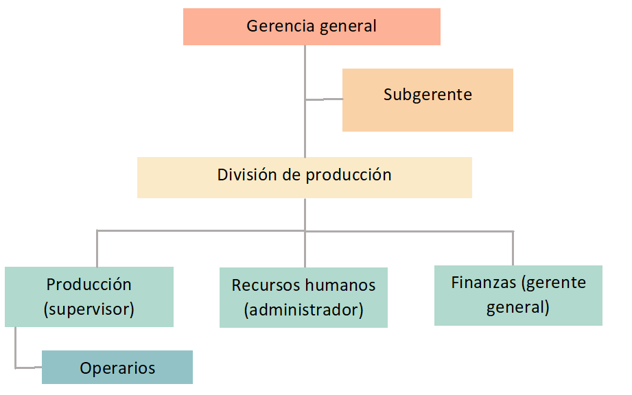
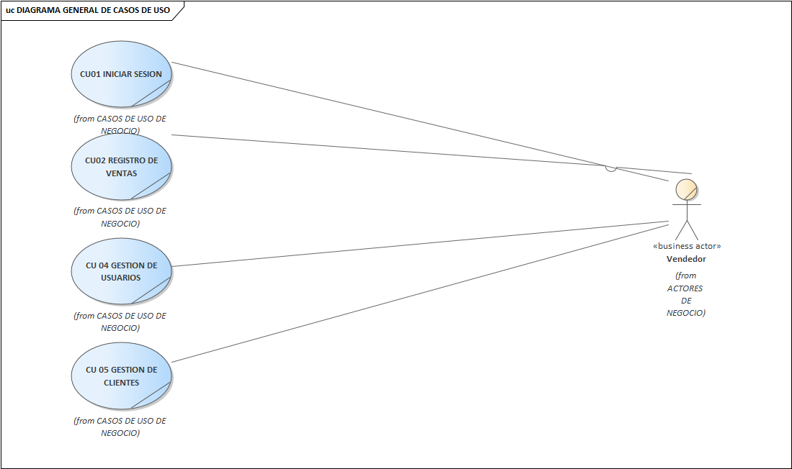
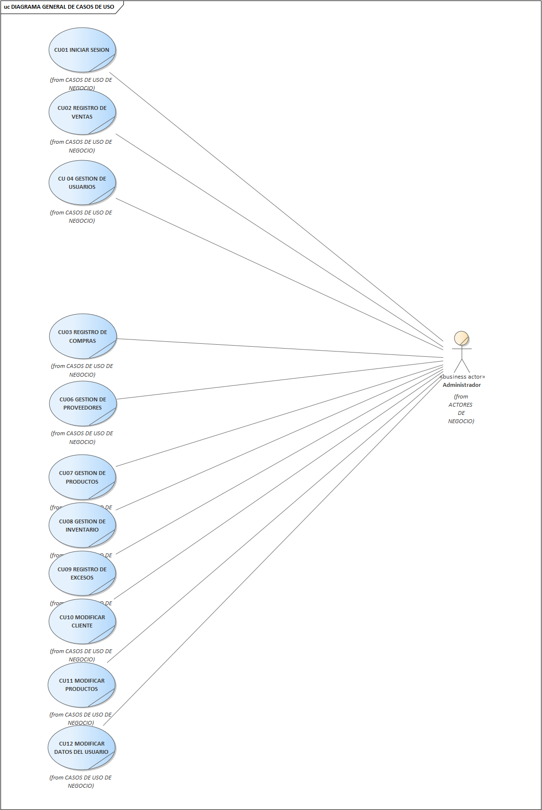
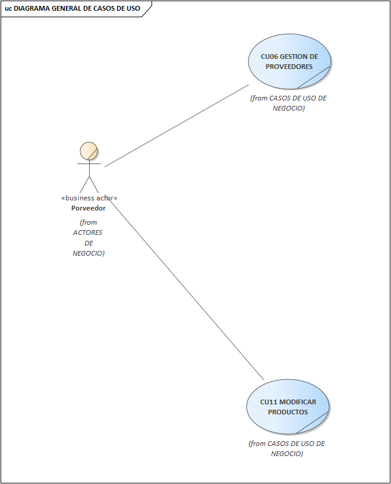
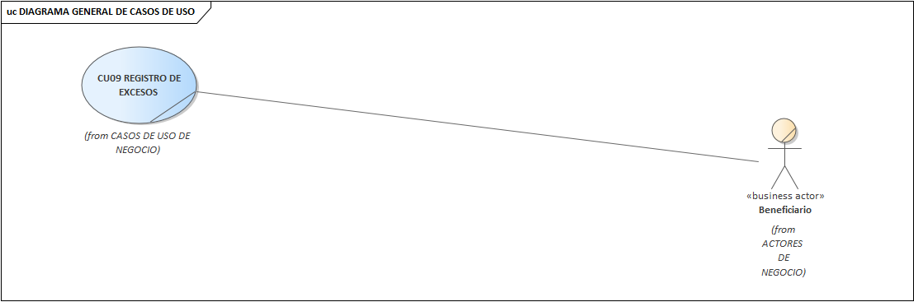

## “PROYECTO DE ANALISIS DE SISTEMAS”
# **SISTEMA DE INVENTARIO PARA LA EMPRESA NABU TECHNOLOGIES**
## ASESOR: RICHARD L. BERROCAL 
INTEGRANTES:| ORCID| PORCENTAJE DE TRABAJO 
---|---|---
Damazo Valdeos, David Jared| 0000-0002-4823-7379| 100%
Esteban Lastaunado, Dibail Sidane| 0000-0002-3473-338X| 100%
Lopez Roman, Segundo Artemio| 0000-0001-9993-6797| 100%
Obregon Moran, Max Smith| 0000-0001-9226-5388| 100%
Remigio Ramirez, George Neffer| 0000-0002-7269-5927| 100%
Rocca Puma, Maykol| 0000-0003-2979-0715| 100%
Rojas Flores, Daniela Ariana| 0000-0001-7975-4785| 100%

## RESEUMEN EJECUTIVO:
Somos una microempresa que lleva 3 años en el mercado, que busca brindar servicios de venta de plásticos. Tenemos como principales actividades: fabricación de productos de bolsas de plásticos y venta al por menor productos nuevos en comercios especializados. Este trabajo está enfocado en la implementación de un sistema de inventario en la empresa "Nabu Technologies" que tiene entre sus propósitos mejorar reducir los excedentes de servicios, aumentar el ingreso en la empresa, practicar las políticas medioambientales, optimización de proceso de venta.

## INTRODUCCION:

Actualmente en coyuntura por la pandemia del COVID-19 el uso de tecnologías a nivel mundial vio un auge en el uso de la información (Del Mar, 2018) , esto ha dado paso a diversos países en incrementar la enseñanza virtualizada de la programación para grandes sectores  informáticos entre ellos los lenguajes de programación se popularizaron por el incremento de puestos de trabajo como programadores ,a raíz de esto diversos países ve reflejado en la mejora de los resultados en la adaptación y al uso de las tecnologías en el manejo de Inventarios en centros comerciales (Hernández et al., 2017) .

En Latinoamérica también se ha visto esta situación, según los últimos registros nos da a conocer que muchos países como Ecuador, Brasil, Paraguay, entre otros, han incrementado el uso de la tecnología virtual y la globalización de las TIC. En Ecuador se puede evidenciar el uso del modelo administrativo mediante la dinámica de sistemas en la gestión de inventarios, siendo esta el fortalecimiento de las operaciones empresariales, es de precisar que esta tiene el estudio fundamentalmente en el visón al futuro de las estrategias administrativas. (Samaniego, 2019).

Asimismo, el Perú se viene adaptando a la implementación de las nuevas tecnologías en los diferentes ámbitos sociales y organizacionales, frente a las deficiencias en la implementación y modernización de las empresas y microempresas en el manejo de la base de datos e inventarios, cabe indicar que la aplicación de la inventarios en la actualidad es imprescindible para un mejor manejo de la productividad laboral en los diferentes sectores mediante la innovación tecnológica (Rojas, 2017).

En cuanto (Ríos, 2018), en su estudio de “Sistema Web para mejorar el control de inventarios en la empresa Comercial Lucerito, 2018”, nos muestra como objetivo proponer un sistema web para mejorar el control de inventario en la empresa Comercial Lucerito, diagnosticando el estado actual para diseñar propuestas para mejorar el control de inventario, Este estudio pretende demostrar a través de una investigación holística, teorías y conceptos validos para evaluar la problemática global de la mencionada empresa, y de esta manera propone de manera eficiente la solución al problema, con la mejora del control y centralización de la información del inventario.

Al respecto la investigación del inventario que se cuenta en la empresa “Nabu Technologies” no permite al usuario poder administrar de manera correcta sus ingresos y egresos, aun trabaja de manera anticuada registrando todo a través de boletas escritas a mano, lo cual no permite realizar una búsqueda de manera eficiente al momento de  querer visualizar registros pasados, una vez implementado el SI, se podrá visualizar de manera factible la producción exacta realizada, el material que ingresó a la empresa y distribución, todo de manera fácil e intuitiva con el usuario.

El presente informe tiene como objetivos:
 - Reducir los excedentes de servicios.
 - Aumentar el ingreso en la empresa.
 - Practicar las políticas medioambientales.
 - Optimización de proceso de venta.

### Datos de la empresa
La empresa “Nabu technologies” es una microempresa que lleva 3 años en el mercado, que busca brindar servicios de venta de plásticos. Tenemos como principales actividades: fabricación de productos de bolsas de plásticos y venta al por menor productos nuevos en comercios especializados.
Esta empresa tiene como misión querer seguir brindando nuestros servicios adecuándose a las diversas situaciones que se presenten. “Nuestra visión es lograr el crecimiento de nuestra empresa, para poder adquirir más locales y así llegar a más personas. Todo eso mediante el respaldo de nuestros clientes.”
Su organigrama está representado de la siguiente manera:

## 1.	ESTUDIO DE FACTIBILIDAD

### 1.1.	Factibilidad operativa y técnica: La visión del sistema
Nuestro sistema está programado para poder facilitar el registro y control de inventario al usuario, además de ser fácil de manejar, ayudará a evitar largas horas de sacar cuentas, siendo de costo gratuito solo se necesitará de una computadora con características básicas. 
    
#### Organización
- Se garantiza la elaboración y utilización del software, ya que será establecida en nuestra pequeña empresa, esta se realizará y utilizará en el campo.
- 	Se contará con el apoyo de nuestro grupo para el diseño, mantenimiento y realización de este software.
#### Tecnica
- Nosotros como grupo estaremos presentes en la realización y producción del software. 
- 	Será un acceso directo al programa para almacenamiento de materiales.
- 	Acceso a las entradas de producción.
- 	Disponibilidad de personal para el mantenimiento.
- 	Disponibilidad de la tecnología para satisfacer su necesidad.

## 2.	MODELO DE NEGOCIO
En la actualidad la empresa NABU TECHNOLOGY cuenta con 3 años en el mercado, se destaca de las demás empresas en su rubro, gracias a su gran equipo de trabajo, gran producto y el trato que se le da a los clientes son todas estas características que la diferencia de la competencia.

### 2.1Factibilidad operativa y técnica: La visión del sistema

#### 2.1.1.	Lista de Actores de Negocio
ACTOR|	Descripción
---|---
Administrador|	    El administrador tiene acceso al sistema y tiene la gestión de procesos de la empresa.
Vendedor |   	El vendedor se encarga de la venta de los productos y su gestión.
Cliente |	El cliente realiza el pedido y la compra de producto.
Proveedor|   	El proveedor proporciona los materiales necesarios para la producción de los productos.
Beneficiario|     	El beneficiario es la entidad beneficiada a la cual se le donara.

#### 2.1.2.	Lista de Casos de Uso del Negocio
CASOS DE USO|	Descripción
---|---
Loggear|	El administrador y vendedor inician sesión.
Registrar venta|	El vendedor anota la venta realizada.
Registrar compra|	El administrador anota la compra realizada.
Gestión de usuarios|	El administrador gestiona un usuario a los trabajadores de la empresa.
Gestión de clientes|	El vendedor registra a los clientes. 
Gestión de proveedores|	El administrador gestiona a los proveedores.
Gestión de productos|	El administrador gestiona a los productos que luego serán consultados por el vendedor.
Gestión de inventario|	El administrador registra la entrada y salida de los procesos de la empresa. 
Registro de excesos|	El administrador registra los excedentes de los productos que tiene la empresa que luego serán llevados a un centro de beneficencia.
Modificar cliente|	El administrador modifica los datos del cliente.
Modificar producto|	El administrador modifica los datos del cliente.
Modificar usuarios|	El administrador modifica los datos del usuario.
#### 2.1.3 DIAGRAMA DE CASOS DE USO

#### 2.1.4.	Especificaciones de Casos de uso del Negocio
CASO DE USO|	Loggearse
---|---
Descripción|	Este caso de uso empieza cuando el administrador o vendedor inician sesión en el sistema
Actores de negocio|	Administrador y vendedor
Entradas|	Detalle del usuario, nombre de usuario, password del usuario
Entregables|	Ingreso del usuario en el sistema
Mejoras |	Permitir que el usuarios que pueden recibir actualizaciones, de los reportes cuando inicien sesión.

CASO DE USO	|Registrar venta
---|---
Descripción|	Este caso de uso empieza cuando el vendedor ingresa al sistema los datos de la venta y el administrador puede modificar el registro de ventas.
Actores de negocio|	Vendedor, administrador
Entradas	|Modificar registro, generar reporte
Entregables	|
Mejoras 	|Generar reporte de ventas de acuerdo al registro de ventas que hace el vendedor.

CASO DE USO|	Registrar compra
---|---
Descripción|	Este caso de uso empieza cuando el administrador ingresa al sistema para realizar el registro de las materias primas adquiridas del proveedor.
Actores de negocio|	Administrador
Entradas	|Descripción de la materia prima, datos del proveedor, fecha de entrega, solicitud de cotización
Entregables	|El administrador hace una solicitud de cotización al proveedor.
Mejoras 	|Actualización de constante de los precios del producto, de acuerdo a la cotización. 

CASO DE USO|	Gestionar usuarios
---|---
Descripción|	El administrador gestionará los usuarios de los vendedores.
Actores de negocio|	Administrador y vendedor
Entradas|	Datos del vendedor, número de ventas
Entregables|	Control de acceso e ingresos a la empresa
Mejoras |	Información ordenada de los vendedores y su respectivo control de acceso a los sistemas, equipos, etc.

CASO DE USO|	Gestionar clientes
---|---
Descripción|	El vendedor registrará a los clientes.
Actores de negocio|	Vendedores y clientes
Entradas|	Datos del cliente, número de compras
Entregables|	Ventas
Mejoras |	Incremento de ventas al no perder potenciales clientes

CASO DE USO|	Gestionar proveedores
---|---
Descripción|	El administrador desarrollará relaciones con proveedores de bienes y servicios.
Actores de negocio|	Administrador y proveedores
Entradas|	Productos de materia prima
Entregables|	Inversiones
Mejoras |	La empresa comprará materia prima para generar más producción y optimizar las ventas.

CASO DE USO|	Gestionar productos
---|---
Descripción|	Este caso inicia cuando el cliente solicita el producto, y el administrador requiere la materia prima y realiza un proceso para realizar el producto, asimismo culmina cuando se hace la entrega del mismo.
Actores de negocio|	Cliente, Administrador, Producción
Entradas	|Inicio de procesamiento de la solicitud del cliente (solicitud de materia y producción)
Entregables	|Producción del producto solicitado y proceso de entrega del mismo.
Mejoras 	|El cliente solicitara el producto que requiere, mediante el cual el administrador podrá prever la cantidad de materia que se necesitara para la producción de lo solicitado, el mismo que en un plazo breve podrán dar respuesta a su solicitud y entrega y de esta manera poder gestionar eficientemente la producción y gastos que genera la producción.

CASO DE USO|	Gestionar inventario
---|---
Descripción|	Inicia cuando el administrador registra la solicitud del cliente, después registra y entrega los materiales al área de producción para la fabricación del producto, asimismo inspecciona la producción, finalmente registra en el inventario y procede a la entrega al cliente.
Actores de negocio|	Administrador, Producción
Entradas|	El administrador registra y entrega la materia prima
Entregables	|El área de producción entrega al administrador lo fabricado.
Mejoras |	Mediante la implementación del sistema, el administrador podrá tener mayor control del almacén de la materia prima, asimismo optimizará la fabricación del producto de manera eficiente, y la entrega será en el tiempo más breve para la satisfacción del cliente.

CASO DE USO|	Registrar excesos
---|---
Descripción|	Este proceso inicia cuando el área de producción, tiene excesos y las desecha, y culmina cuando el administrador registra estos y el beneficiario solicita los excesos.
Actores de negocio|	Producción, Administrador, beneficiario
Entradas|	Producción desecha excesos y el administrador lo registra.
Entregables	|El beneficiario solicita a la administración los desechos excedentes.
Mejoras |	Mediante el sistema el área de producción podrá registra los desechos y el administrador podrá tener la cantidad de esta, asimismo el beneficiario podrá solicitar y la respuesta será inmediata ya sea con la entrega de estos o no.

CASO DE USO	|Modificar cliente
---|---
Descripción|	Este caso de uso permite editar los datos del cliente en el sistema
Actores de negocio|	Cliente, Administrador
Entradas|	Datos del cliente
Entregables|	Actualización de datos del cliente en el sistema
Mejoras 	|Permitir él envió de una copia de la edición de los datos del cliente al correo, para una mayor transparencia con el manejo de datos del cliente.

CASO DE USO|	Modificar usuarios
---|---
Descripción	|Este caso de uso permite editar los datos del usuario en el sistema
Actores de negocio|	Administrador
Entradas|	Detalle del usuario, nombre de usuario, password del usuario
Entregables|	Actualización de datos del usuario en el sistema
Mejoras |	Permitir el envío de los datos de acceso de los usuarios al correo del usuario cada vez que se realice una modificación.

CASO DE USO|	Modificar producto
---|---
Descripción|	Este caso de uso permite editar los datos del producto en el sistema
Actores de negocio|	Proveedor , Administrador
Entradas|	Detalle del producto, precio de venta del producto, fecha de producción.
Entregables|	Actualización de datos del producto en el sistema
Mejoras |	Permitir la actualización diaria del precio de los productos en base al costo de la materia prima.

### 2.2.	Modelado de análisis de negocios
#### 2.2.1.	Lista de Trabajadores de Negocio
Lista de trabajadores de negocio
Nombre|	Descripción
---|---
Administrador|	El administrador tiene acceso al sistema y tiene la gestión de procesos de la empresa.
Vendedor|	El vendedor se encarga de la venta de los productos y su gestión.

#### 2.2.2.	Lista de Entidades de Negocio
A diferencia de modelo de caso de negocio en el modelo de análisis pasamos a una vista   interna   del   proceso   de “Sistema de inventario”, pudiendo analizar los trabajadores de la empresa "Nabu Technologies" y además identificaremos las entidades que se manejan en nuestro proceso.
Para la lista de las entidades de negocio (EN) utilizar el siguiente cuadro, donde:
Origen: I=Interna, generada por el propio negocio, E=Externa, generada externamente y usada por el negocio como dato o medio de comunicación; 
Tipo: P=Persistente, que almacena datos, F=Formulario o documento impreso>

LISTA DE ENTIDADES DE NEGOCIO|	Descripción	|Origen|	Tipo
---|---|---|---
Registro de usuario	|Documento donde se encuentran los datos de los usuarios |	I	|F
Registro de cliente	   |Documento donde se encuentran los datos del clientes|	I|	F

### DIAGRAMA DE CLASES

